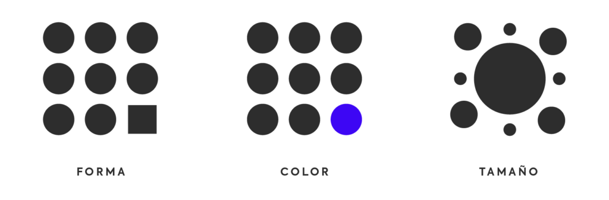
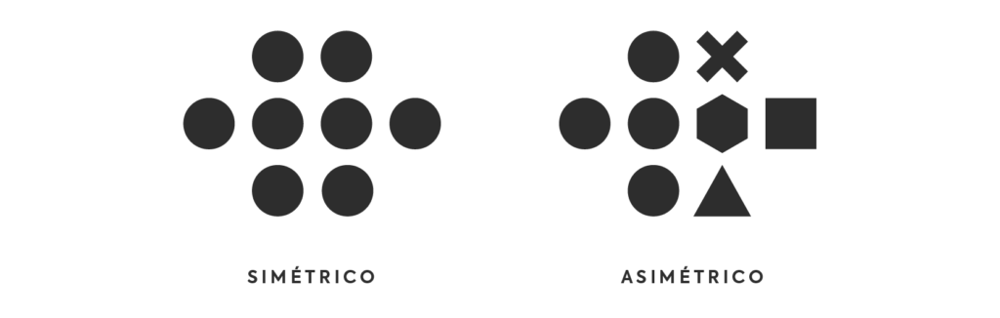
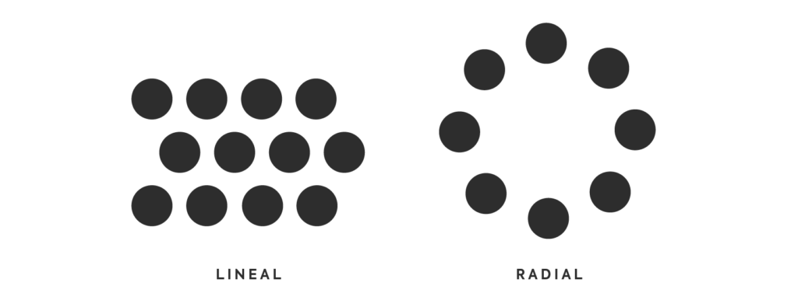
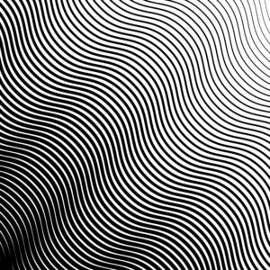
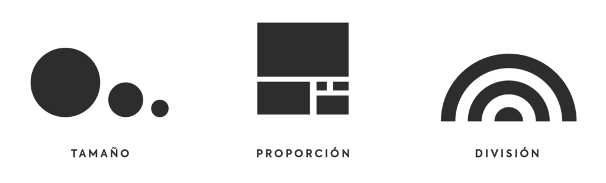
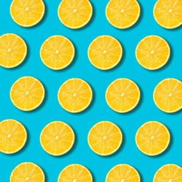
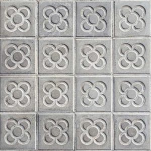
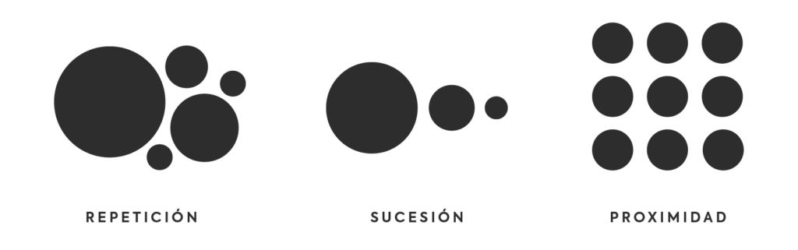
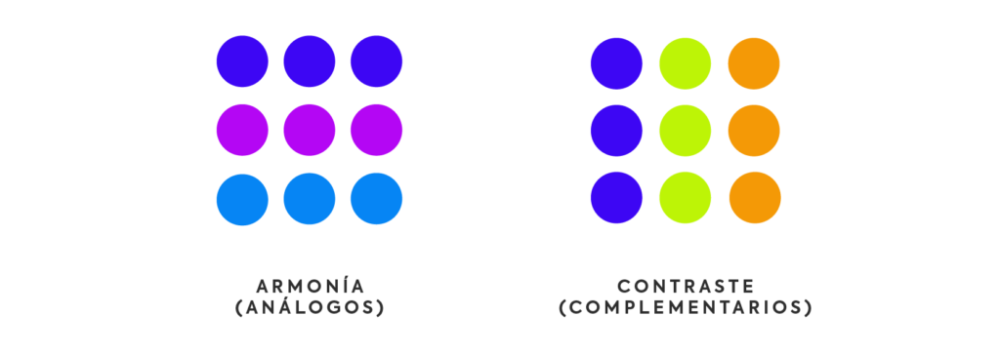

\mainmatter

## Elementos básicos del diseño

Comencemos detallando los 6 elementos básicos con los que un diseñador puede crear sus composiciones. ¿Cuáles son los 6 elementos que puede contener un diseño? Todos, sin excepción, disponen de alguno de ellos:

- **Línea**. Quizás el más básico. Todo comienza con una línea. Una línea corta puede verse como un punto.

- **Dirección**. Todas las líneas tienen una dirección y según cual sea, puede provocar diferentes percepciones. Por ejemplo: una línea vertical da sensación de altura, una horizontal de estabilidad, una en diagonal, crecimiento (si va de menos a más, de izquierda a derecha) o descenso (si va de más a menos, de izquierda a derecha). ¿Te lo habías planteado?

- **Forma**. Línea + dirección = forma. Las formas están compuestas por líneas, bien cerradas o abiertas (y aquí es donde entra, por ejemplo la Ley de Cierre de Gestalt, donde el cerebro “cierra” o “une” esos espacios). Pueden ser líneas explícitas, o bien utilizando otros principios como el contraste, o elementos como el color, que también crean formas.

- **Tamaño**. El tamaño también es un elemento importante de todo diseño. Un mismo elemento repetido en dos tamaños diferentes pueden provocar sensaciones diferentes: tamaño (propiamente dicho), distancia o jerarquía.

- **Color**. Un elemento fundamental. Y por color, entendemos todos: blanco, negro, rojo, azul, etc. El color nos ayuda a contrastar elementos y no olvidemos su peso emocional, donde cada color tiene varios significados. Por ejemplo: el color blanco transmite pureza, paz, limpieza, perfección… El color se compone de 3 valores: color (verde), saturación (cantidad de verde puro, su ausencia es una escala de grises) y brillo (luminosidad del color, más próximo al blanco o al negro).

- **Textura**. Un derivado del color. La textura añade ese toque extra de realidad, ya que en la naturaleza no solemos encontrar objetos con colores planos 100%, y la textura nos aporta una información extra de la superficie del objeto.

# Principios de la composición {#intro}

El **diseño gráfico** es un proceso creativo que consiste en **transmitir un mensaje** a través de una *comunicación visual*. Dentro de este proceso, existe lo que se conoce como *principios de la composición* en diseño gráfico.


Entendemos por **composición** como la **disposición** de los elementos sobre un plano o el espacio. Dichos *elementos* pueden ser de distintos tipos.

Se trata de una clase de **reglas** que sirven como **guía**, no como leyes, y permiten **construir y comunicar** el mensaje, para que éste se transmita de la forma más exitosa posible.

Se consideran los siguientes  principios:


## Énfasis o punto focal

```{definition, enfasis, name="Énfasis"}
Este otro principio de la composición se basa en un elemento que domina sobre el resto en condición de subordinación. Dentro de la jerarquía, encontramos 3 subtipos:

* Alineación
* Escala
* Color
* Forma

```

```{r enfasisw, echo=FALSE, out.width='100%', out.height='100%', fig.align="center", fig.cap="Unidad continuidad"}

```


## Equilibrio o balance

```{definition, r, name="Equilibrio"}
El equilibrio se basa en la organización de los elementos de modo que **nada domine en el plano o bien para que una parte pese más que la otra**.

Existen dos tipos de equilibrio: la simetría y la asimetría.
```


- **Balance Simétrico**: se da cuando los elementos se disponen simétricamente a ambos lados de los ejes, horizontal o vertical.

- **Balance Asimétrico**: se da cuando los elementos no mantienen simetría por forma, pero sí por peso visual.

```{r equilibrio, echo=FALSE, out.width='100%', out.height='100%', fig.align="center", fig.cap="Unidad continuidad"}

```
<!--  -->

## Ritmo o movimiento

El principio del ritmo consiste en la **repetición de elementos** con el fin de conseguir una **composición harmoniosa**. Dicha repetición puede ser **constante o alterna**, afectadas por el color, la forma, etc.

Este principio pretende expresar el movimiento en la composición y existen dos clases:

* **Regular**, cuando el movimiento es uniforme y constante
* **Progresivo**, cuando el movimiento es alterno y varía.

El ritmo es la secuencia con que aparecen los elementos que componen el diseño: el orden, la repetición y la forma de organizarlos.

Si se usa correctamente este principio puede ser realmente muy útil para asegurar una correcta lectura de nuestro diseño.

El ritmo de una composición puede ser:

Radial: Si los elementos se disponen de forma circular
Lineal: Si la disposición de los elementos da una forma de continuidad.


```{r ritmo, echo=FALSE, out.width='100%', out.height='100%', fig.align="center", fig.cap="Ritmo regular"}

```
<!--  -->

```{r rythm, echo=FALSE, out.width='100%', out.height='100%', fig.align="center", fig.cap="Ritmo regular"}

```

<!--  -->

```{r rythmm, echo=FALSE, out.width='100%', out.height='100%', fig.align="center", fig.cap="Ritmo progresivo (secuencial)"}

```
<!--  -->

## Proporción o Escala
El **principio de proporción** se basa en la relación del tamaño de los objetos con la composición final. La proporción nos ayuda a comunicar la **relación entre los diferentes elementos de diseño**. También puede ayudarnos a marcar como más importante alguna parte en concreto,  ya que los elementos grandes captan más atención que los pequeños.

Dentro del principio de escala podemos tener en cuenta 3 subcategorías:

* **Tamaño**: cuando nos encontramos con elementos de diferentes tamaños relacionados entre sí.

* **Proporción**: elementos relacionados unos con otros, en una proporción visualmente armónica.

* **División**: elementos divididos en diferentes tamaños, creando todos ellos una unidad.

```{r proporcion, echo=FALSE, out.width='100%', out.height='100%', fig.align="center", fig.cap="Ritmo regular"}

```
<!--  -->

## Unidad

Este principio de la composición tiene lugar cuando un conjunto de **elementos** se **organizan y se relaciona entre sí**; de manera que acaban representando un **solo elemento**.

Dentro del **principio de unidad**, encontramos 3 variantes (sub-principios):

- **Repetición**: cuando el uso de un mismo elemento se utiliza repetidamente para construir la composición.

- **Principio de Sucesión**: Se logra cuando se usa recurrentemente un color o un elemento donde uno de ellos mantiene el punto focal.
- **Continuidad**: cuando los elementos se articulan entorno a la construcción del mensaje.
- **Proximidad**: cuando se utiliza el mismo elemento para construir bloques en la composición.
  * **Crear conexiones**: La proximidad puede generar una relación entre dos objetos, generar relevancia, jerarquía, estructurar
  
  * **Disipar conexiones**: La proximidad también puede reflejar la carencia de relación entre elementos.

Y no debemos olvidar que también podemos otorgar unidad mediante la armonía con el uso de colores análogos o mediante el contraste con el uso de colores complementarios, como puede verse aquí abajo.


```{r unidad1, echo=FALSE, out.width='100%', out.height='100%', fig.align="center", fig.cap="Unidad continuidad"}

```

```{r unidad2, echo=FALSE, out.width='100%', out.height='100%', fig.align="center", fig.cap="Unidad continuidad"}

```

```{r unidad3, echo=FALSE, out.width='100%', out.height='100%', fig.align="center", fig.cap="Unidad continuidad"}

```
<!--


-->

